## Starting
This is a sample code being used to show what the setup process is like. At this moment, nothing is setup

## Install package control
If you do not have package control installed, install it from the `Command Palette` ( Cmd+Shift+p on macOS )
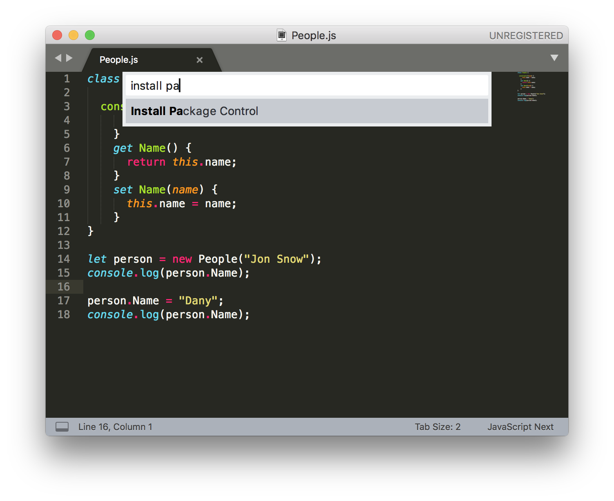

## Install Rainbowth package
Using the command palette, install the `Rainbowth` package:
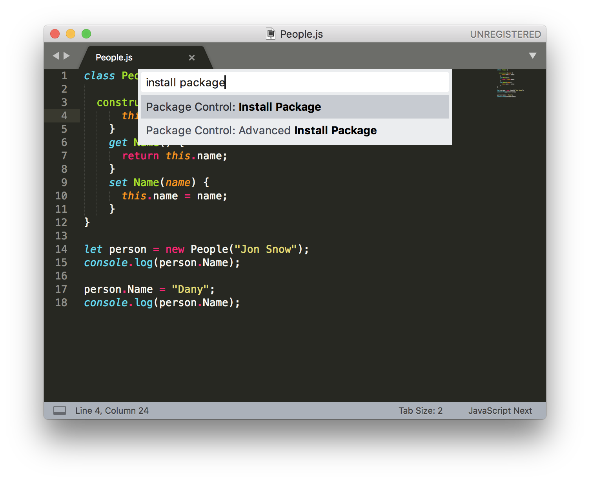
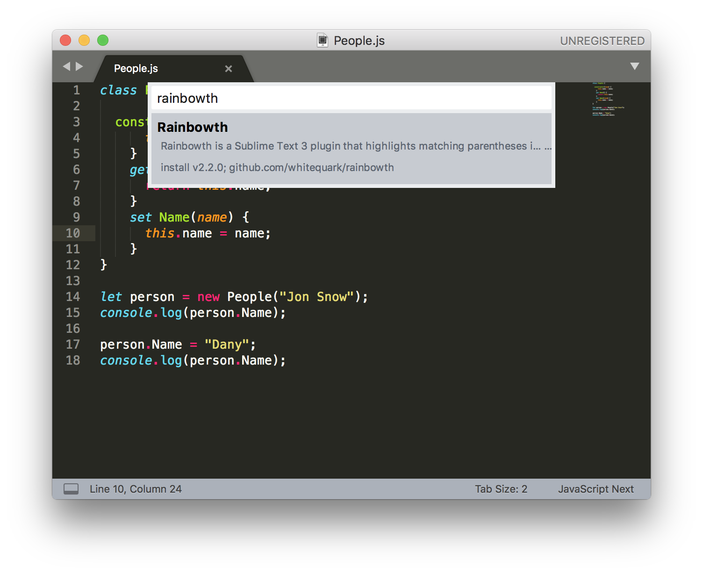

## Browse packages
You can visit your packages by going to *Preferences > Browse Packages...*
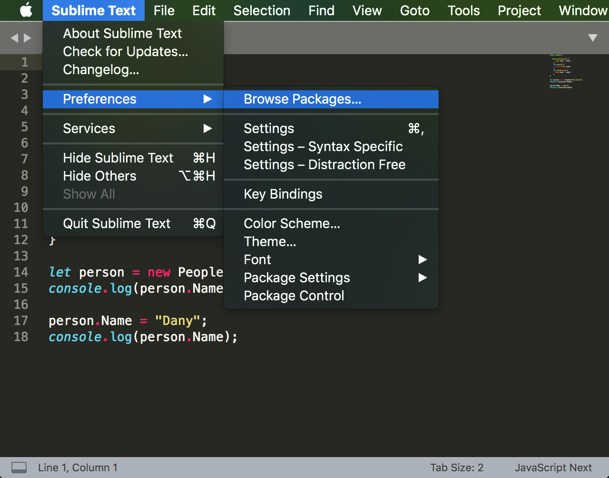

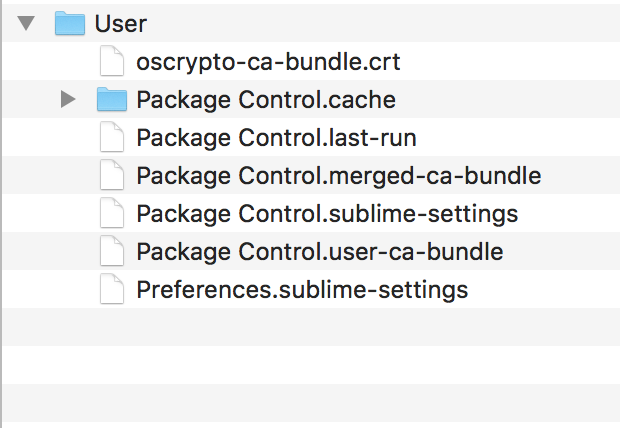

## Install a color theme
For our example, we are going to install the *Dracula theme*
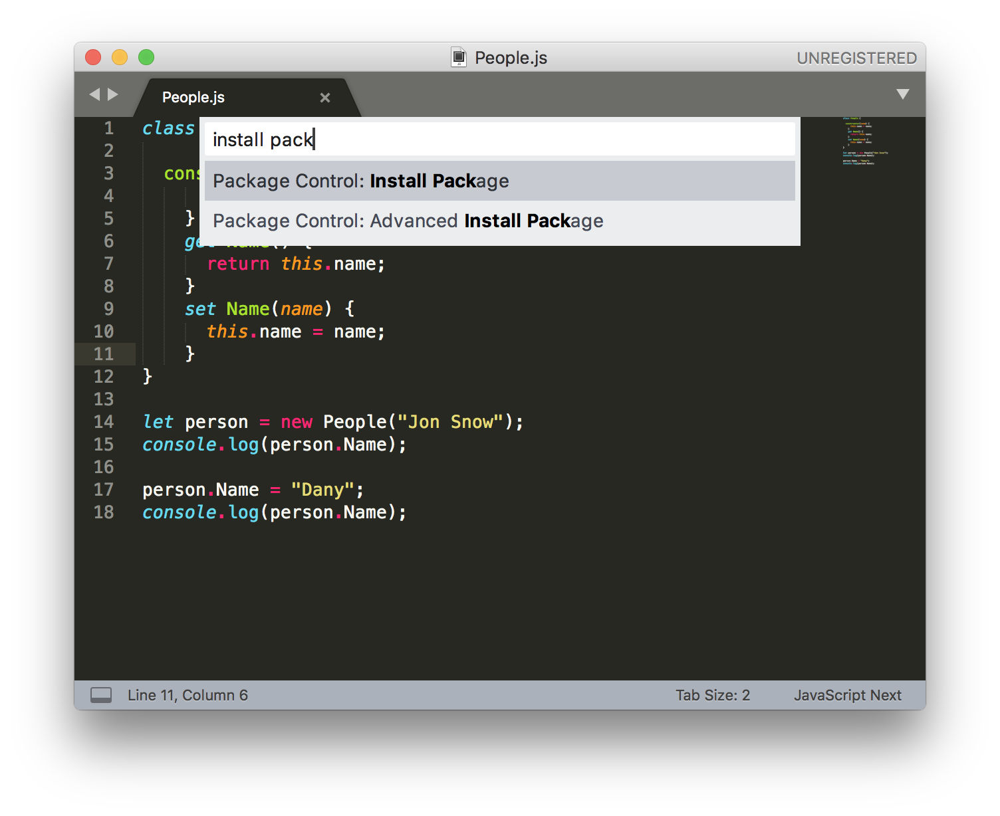

## Set to the installed theme
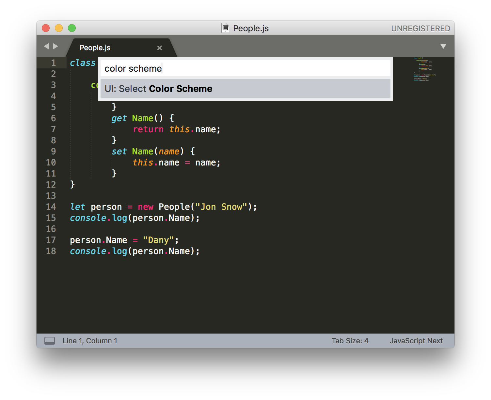
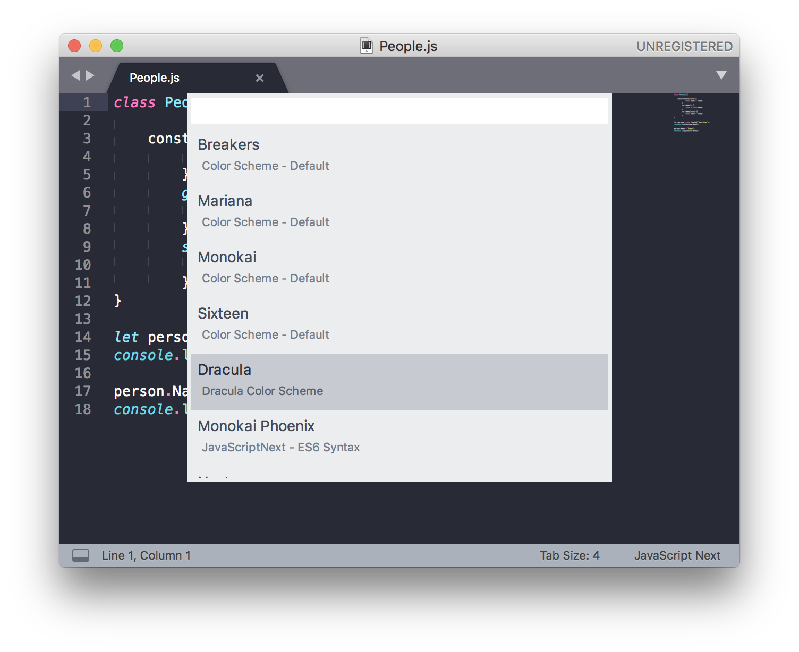

## Install PackageResourceViewer
In order for Rainbowth to be able to edit the themes to color the text, we will have to create the theme files in the *Packages* folder. This can be easily done using a package called **PackageResourceViewer**

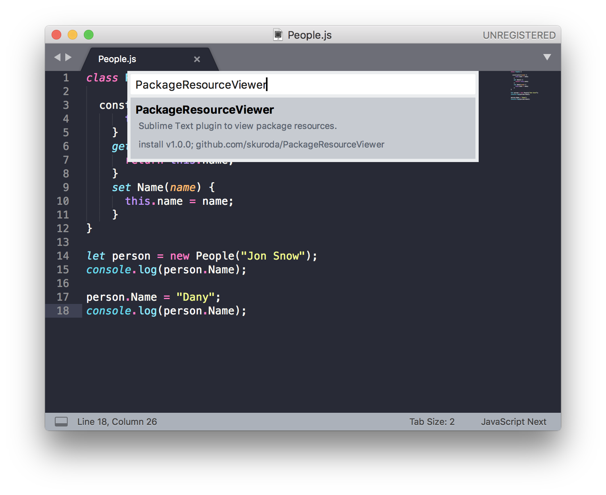

## Extract theme files
Using PackageResourceViewer, extract the relevant files for the theme (in our case, the *Dracula* theme)
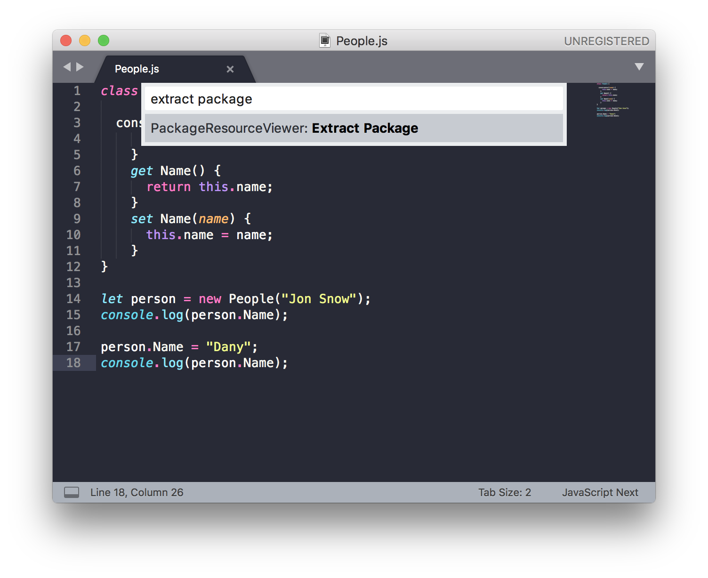
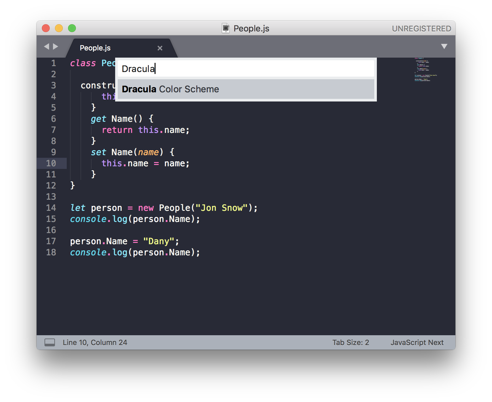

This will create the files related to the theme in *Packages* folder. The folder should look somewhat like this now:
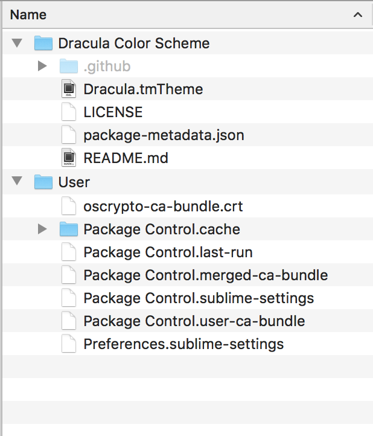

## Rainbowth.sublime-settings
Create a `Rainbowth.sublime-settings` in `User`
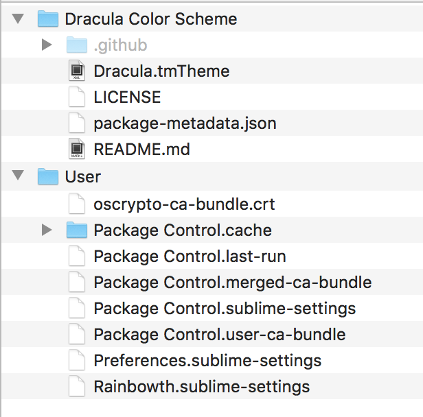

Now, edit the file with languages and colors you want to use

## Success
The changes should apply automatically, if not, quit Sublime and open it again to see Rainbowth working

